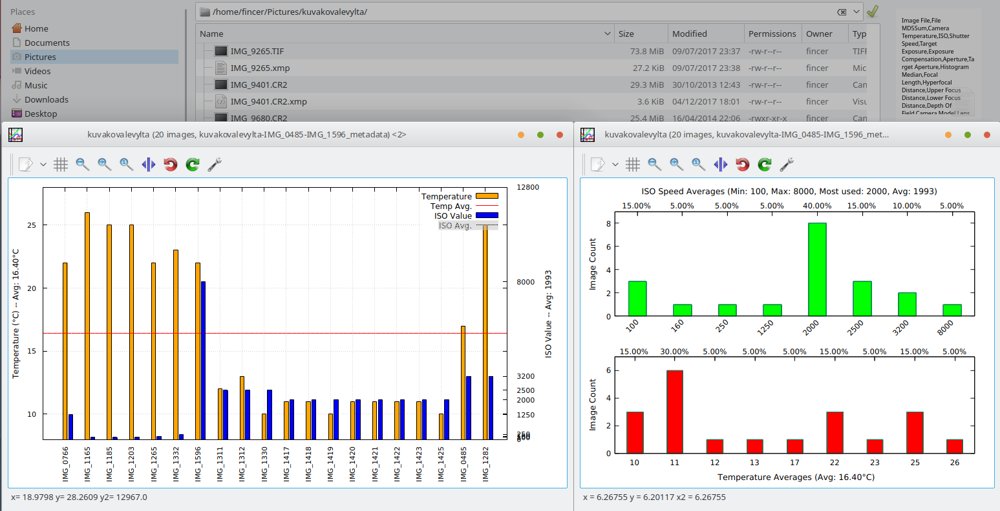
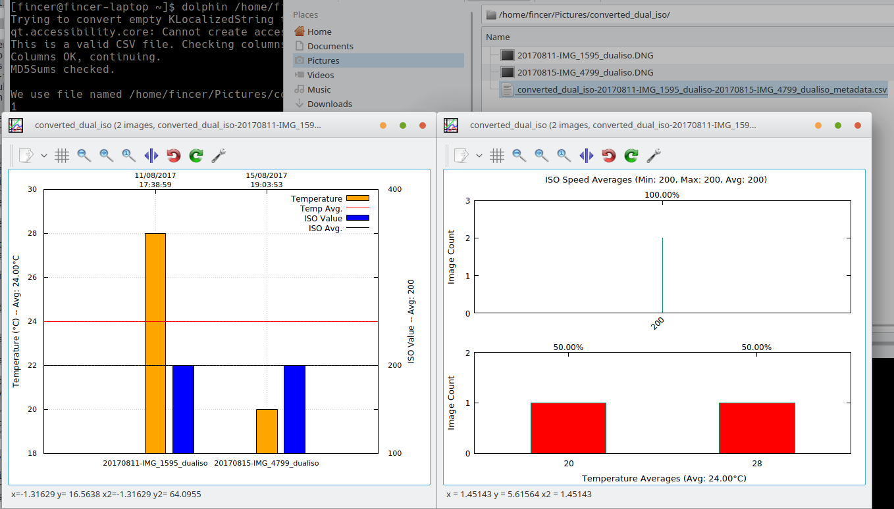
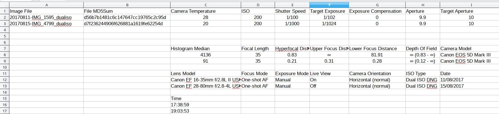
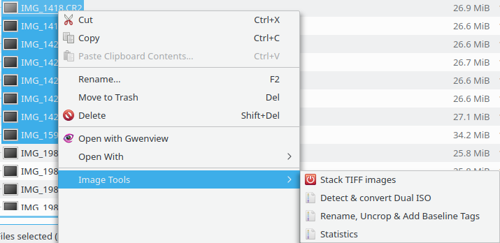
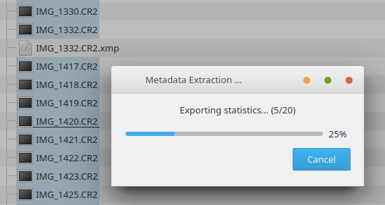

# Linux camera tools for Canon DSLR owners

- main target group:

    - Linux users who own a Canon DSLR camera and may have Magic Lantern firmware on their workflow

    - Linux users who own a Canon DSLR camera and are interested in exporting statistics from their CR2 raw images

    - ...and others alike

## About

### Camera statistics

- Create image statistics easily with a right-click menu entry in Dolphin file manager. Exports statistics from RAW images and draws various plots based on this data

    - Support for following statistics (with GNU Plot):

        - Temperatures & ISOs

    - **NOTE** GNU Plots are not yet supported for

        - Apertures, Exposures & ISOs

        - Focal Lengths & Lenses

        - Shooting & Focus Modes

- Possible to extract all or selected camera RAW metadata and save it into a CSV file for post-processing.

### Dual ISO conversion

- Convert Magic Lantern dual ISO cr2 files easily with a right-click menu entry in Dolphin file manager. 

- Support for individual image and multiple images selection.

- Is able to distinguish single ISO CR2 files from dual ISO CR2 files. You can select multiple CR2 files without need to care about this issue.

- By default, CR2 images contain metadata which crop them in most image viewers. This script removes all cropping tags and you get full-sized images for your post-processing editors as a result.

- Adds `--dry-run` support for cr2hdr. Therefore, the tool can be used just to check whether a CR2 image is a dual ISO image or not. Useful option in scripting & programming.

### Bootable SD Card

- Create a Magic Lantern bootable SD card for your Canon DSLR. Code is released by Magic Lantern project under GPL license.

### MLV info

- Print information about Magic Lantern MLV files on KDE/Plasma desktop environment

### Exiftool - delete critical / all metadata

- Scripts for deleting all or critical (identifiable) metadata from image files. Preferred usage: integrated with Dolphin file manager.

### ALE stack

- Stack multiple non-RAW TIFF images in a directory

## Repository contents

### 0_cr2hdr_tool

Source files for customized cr2hdr tool, required by scripts (statistics, dual ISO conversions...) in this repository.

### 1_magiclantern_bootablecard_linux

Source files for creating an Arch Linux package for Magic Lantern bootable SD card tool.

### 2_gnuplot_patch

Patch file for GNU Plot for better QT integration. Adds and alters some features which benefit generated statistics. Tested with GNU Plot 5.0.6.

### 3_desktop_files_for_kde-plasma-dolphin

Dolphin file manager desktop integration for scripts in this repository.

### 4_scripts

Main scripts for exporting statistics, doing image conversions...etc.

### sample_images

Sample images.

## Screenshots

Temperature & ISO plots for 20 images:

Temperature & ISO plots for 2 images:

Exported statistics:

Dolphin menu entries (KDE/Plasma):

Statistics export progress bar (KDE/Plasma):

## License

Contents of this repository have been published under GPLv2.
